## Práctica 1 SO 

###### Salvador Romero Cortés

**Actividad 1.1 -  Repaso de scripts**

```bash
#! /bin/bash

cp /fenix/depar/lsi/UML/*.gz/tmp		

cd /tmp					

gunzip -d *.gz

./kernel32-3.0.4 ubda=./Fedora14-x86-root_fs mem=1024m

```


**Actividad 1.2 - Valores por omisión para nuevas cuentas**

Valores por defecto de `/etc/default/useradd`

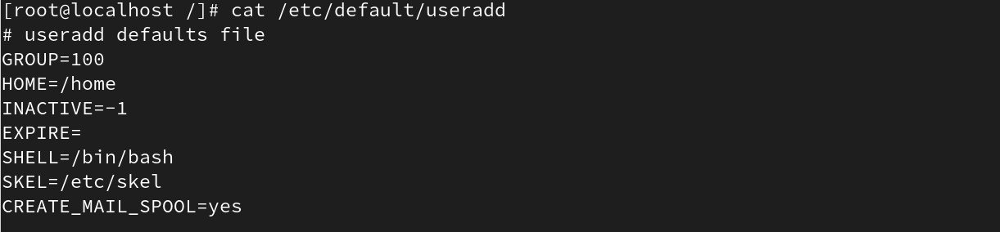

Valores por defecto de `/etc/login.defs`

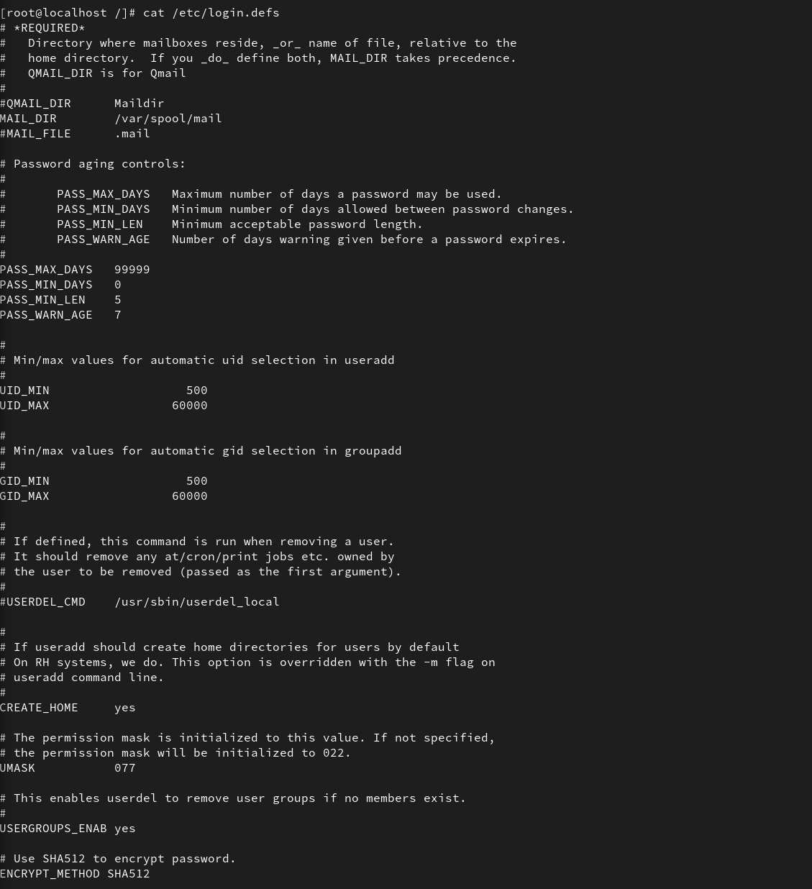


A continuación creamos los usuarios con useradd

```bash
useradd manolo
useradd pepe
useradd antonio
```

y tras la creación vemos como al final de los archivos `/etc/passwd` y `/etc/group` han aparecido los nuevos usuarios

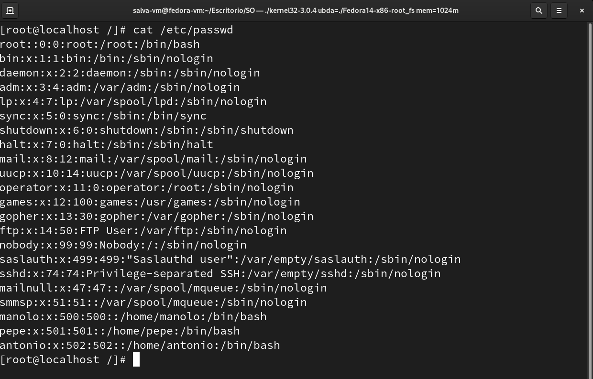

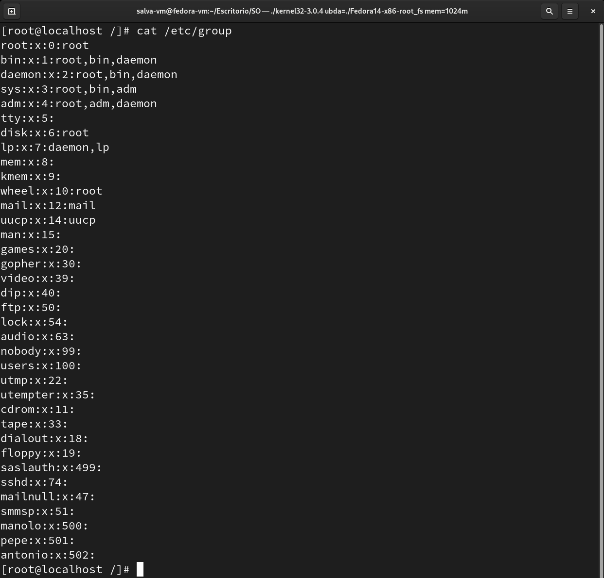

**Actividad 1.3 - Creación de usuarios**

Creamos un usuario nuevo, cuya carpeta home se encuentre en el escritorio con la orden

```bash
useradd usuario -d directorio_home
```

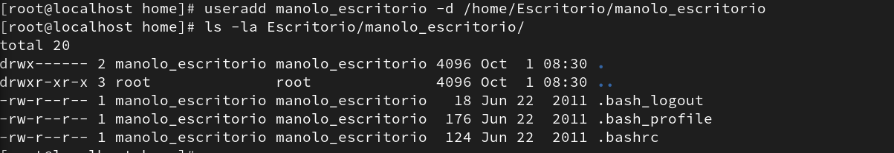

Creamos otro usuario que no tenga directorio home con la orden

```bash
useradd usuario -M 
```

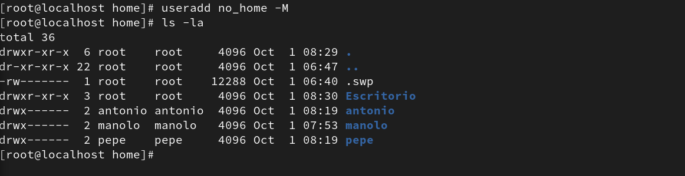

Vemos que no ha creado ningún directorio home.

Ahora creamos uno con un comentario con la orden

```bash
useradd usuario -c comentario
```

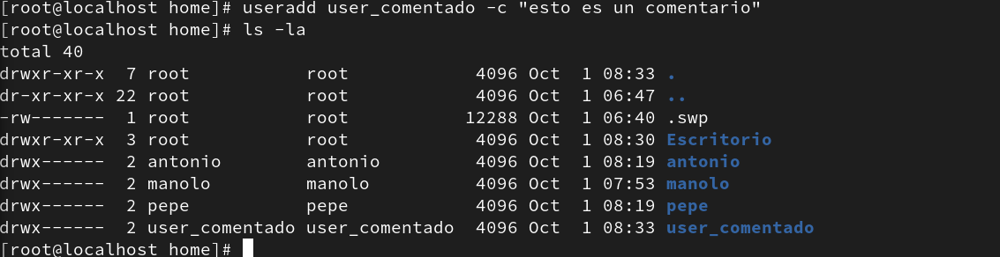


Ahora borremos el usuario `user_comentado` y vemos los restos que deja.

```bash
userdel user_comentado
```

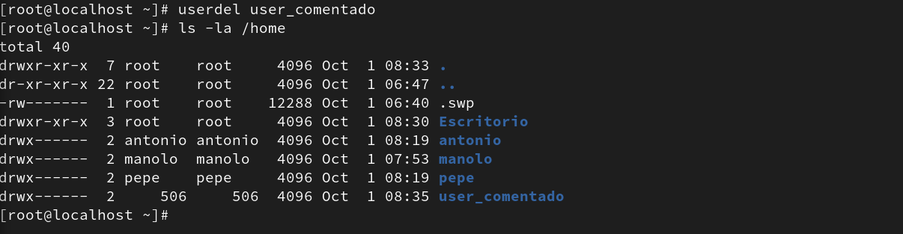

Como vemos, la carpeta home del usuario no se ha borrado. Sin embargo, sí se ha borrado su entrada en los archivos `/etc/passwd` y `/etc/group`

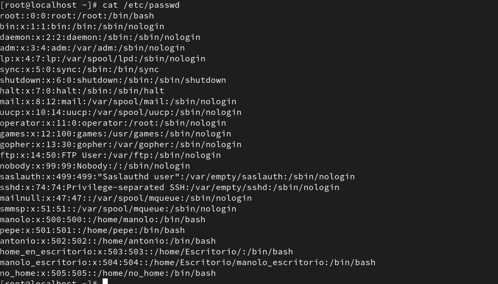

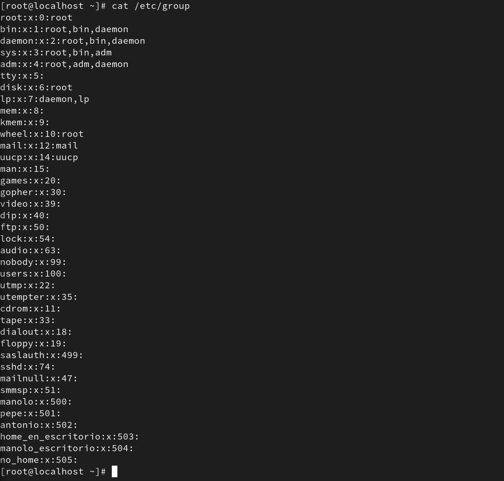


Ahora iniciamos sesión con uno de los usuarios, manolo por ejemplo. Vemos que en su directorio home solo tiene los archivos de configuración genéricos.

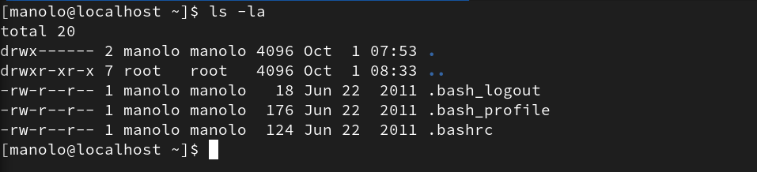


**Actividad 1.4 - Archivo `/etc/passwd` **

El formato del archivo es:

`nombre:x:uid:gid:comentario:directorio home:interprete shell`

Usando la orden `ls -la /etc/passwd` podemos ver que el propietario del archivo es el usuario `root`.

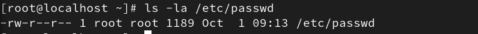

Tiene permisos de escritura y lectura..


**Actividad 1.5 - Archivo `/etc/shadow`**

Desde otro usuario distinto a root no lo podemos ver porque no tenemos permisos de lectura sobre el archivo.

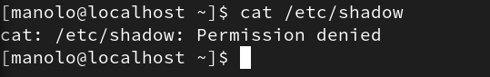


**Actividad 1.6 - Creación de grupos**

Creamos los grupos con la orden

```bash
groupadd grupo1
groupadd grupo2
```

Asignamos los usuarios manolo y pepe al grupo1 y antonio al grupo2.

``` bash
gpasswd -a manolo grupo1
gpasswd -a pepe grupo1
gpasswd -a antonio grupo2
```

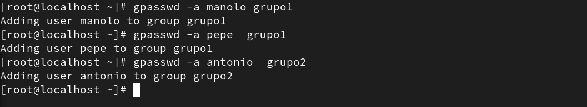

Si usamos id como `root` obtenemos el siguiente resultado

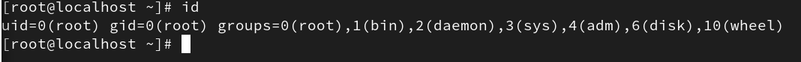


**Actividad 1.7 - Archivo del kernel de Linux**

Usamos la orden `find`

```bash
find -name "vmlinu*"
```


**Actividad 1.8 -  Organización del SA**

Un usuario root podría guardar los archivos temporales en cualquier carpeta si quiere que no se borre. Sin embargo, lo recomendable sería que los guardase en `/var/temp`. Esto es un directorio temporal pero menos volátil que `/tmp`.

**Actividad 1.9 - Información de los SAs**

La diferencia está en que `/etc/fstab` muestra los sistemas de archivos que se pueden montan en el sistema. El fichero `/etc/mtab` muestra los sistemas de archivos *actualmente* montados. Esto incluye a los que se montan durante el boot y manualmente. Si queremos que se monte automaticamente incluimos la línea correspondiente a `/etc/fstab`.

**Actividad 1.10 - Información de los SAs**

Información del archivo

Primer campo: dispositivo

Segundo campo: punto de montaje

Tercer campo: tipo de sistema de archivos

Cuarto campo: opciones de montado asociados al sistema de archivos

Quinto campo: frecuencia. Usado para el dump

Sexto campo: usado por `fsck` para determinar el orden en el que se checkean los sistemas de archivos durante el boot.

**Actividad 1.11 - Archivos de información para los SAs**

* `/etc/fstab`

  Muestra información descriptiva sobre los sistemas de archivos que se pueden montar en el sistema.

  Si queremos que se monte automaticamente incluimos la línea correspondiente a `/etc/fstab`.

* `/etc/mtab`

  Muestra los sistemas de archivos montados actualmente.

* `/proc/filesystems`

  Muestra los sistemas de archivos soportados en el sistema.

* `/proc/mounts`

  Muestra los sistemas de archivos montados actualmente, tanto los automáticos al encender el sistema como los montados manualmente.

